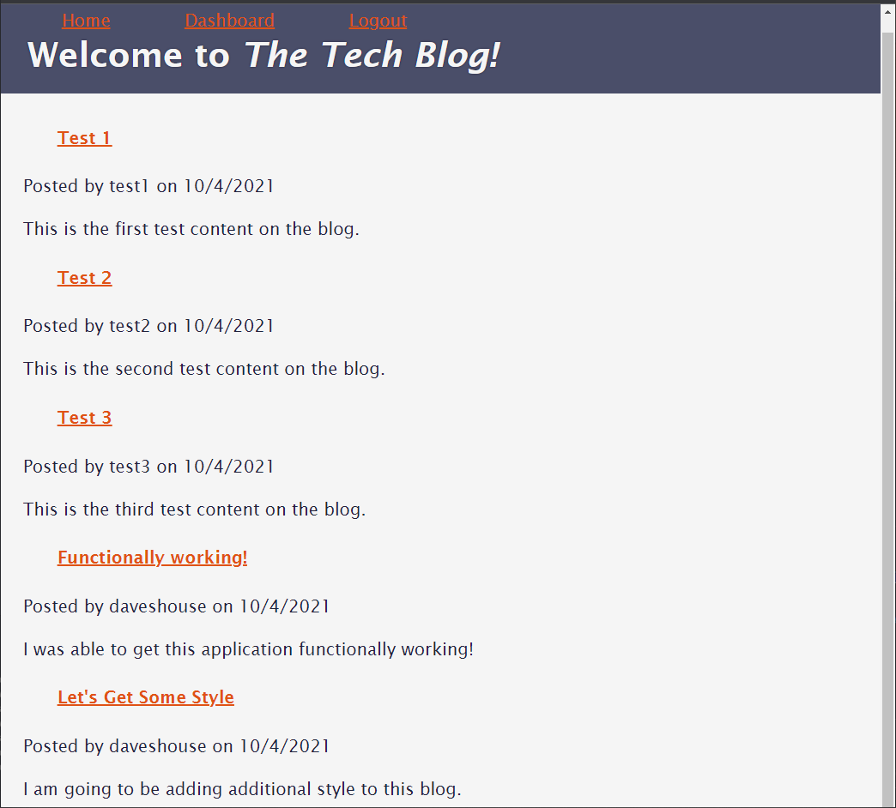
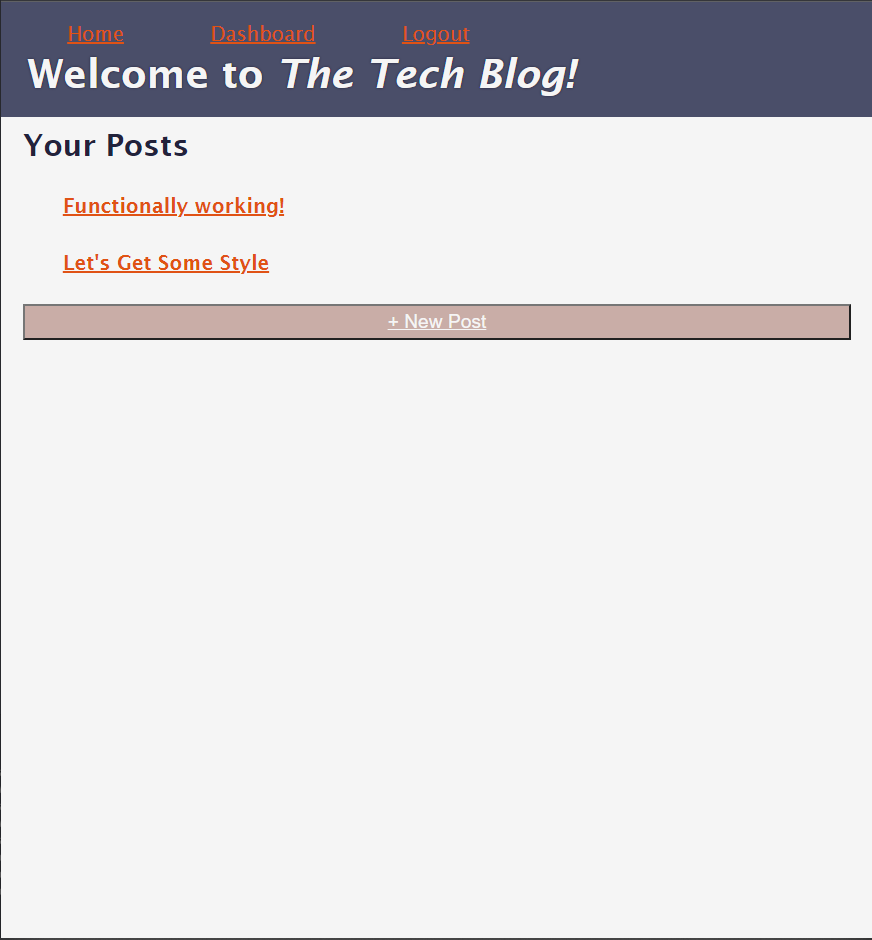

# Tech Blog

## Description

This application is a technical blog for developers to publish content, as well as comment on other blog posts.  It uses a MVC style architecture and uses Heroku as the host for the viewers as well as database infastructure.

## Table of Contents

-[Link](#link)

-[Screenshot](#screenshot)

-[Technologies-Used](#technologies-used)

-[Contributions](#contributions)

-[Credits](#credits)

-[Questions](#questions)

## Link

[Check out this App here!](https://tech-blog-daveshouse44.herokuapp.com/)

## Screenshot

 

 

## Technologies-Used

[express-handlebars](https://www.npmjs.com/package/express-handlebars)

[MySQL2](https://www.npmjs.com/package/mysql2)

[Sequelize](https://www.npmjs.com/package/sequelize)

[dotenv package](https://www.npmjs.com/package/dotenv)

[bcrypt package](https://www.npmjs.com/package/bcrypt)

[express-session](https://www.npmjs.com/package/express-session)

[connect-session-sequelize](https://www.npmjs.com/package/connect-session-sequelize)

[Heroku](https://www.heroku.com/)

## Contributions

David Tierney

## Credits

Trilogy Education Services

## Questions:

[GitHub](https://github.com/daveshouse44)

[LinkedIn](https://www.linkedin.com/in/david-tierney-652030214/)

[Email](mailto:daveshouse44@hotmail.com)
